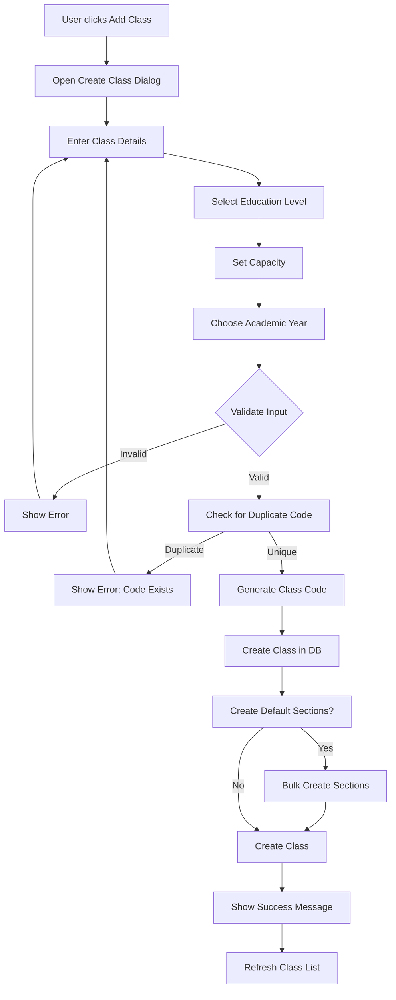
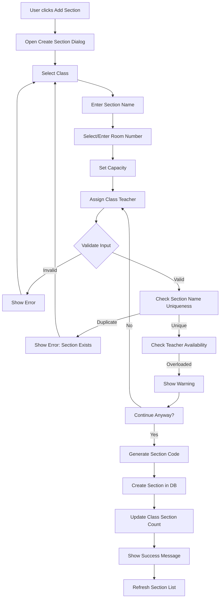
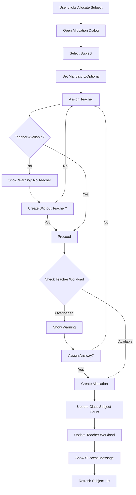
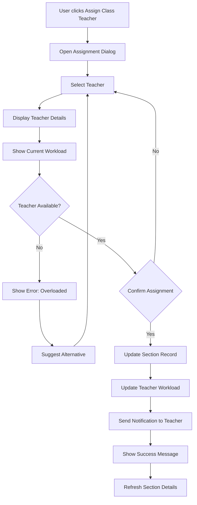
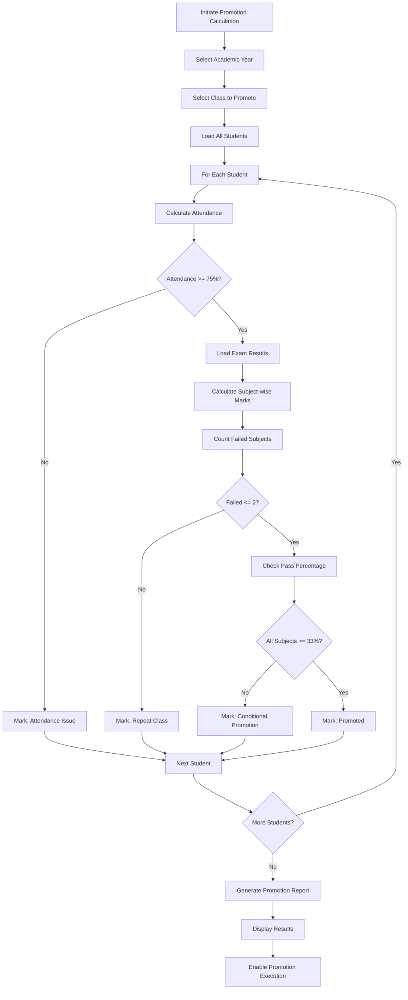
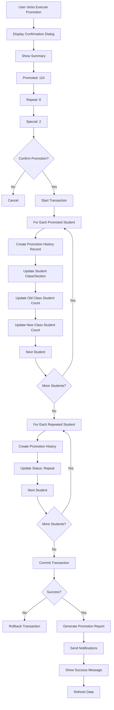
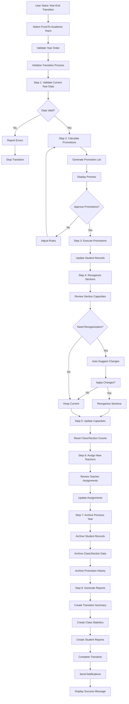
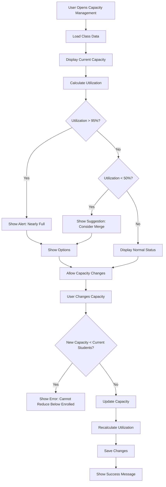

# Class & Section Management Module - Implementation Plan

**Project:** Pakistani School Management System  
**Scale:** 500,000+ students  
**Tech Stack:** Next.js 16, TypeScript 5, Prisma ORM, SQLite  
**Status:** Planning Phase

---

## 📋 Executive Summary

This document outlines the comprehensive implementation plan for the Class & Section Management module, a critical component of the Pakistani School Management System. The module will handle all aspects of class and section administration, including subject allocation, teacher assignments, capacity management, and class promotion workflows, specifically designed for Pakistani educational contexts (Primary, Middle, Matric, FSc, O-Level, A-Level).

---

## 🎯 1. Feature Breakdown

### 1.1 Core Features

#### A. Class Management (CRUD Operations)
**Description:** Complete lifecycle management of academic classes

**Capabilities:**
- Create, Read, Update, Delete classes
- Support for Pakistani education system levels
- Class codes and naming conventions
- Capacity planning per class
- Active/Inactive status management
- Multi-school support

**Pakistani Class Hierarchy:**
```
Primary Level (Classes 1-5)
├── Class 1 (Nursery/Kindergarten optional)
├── Class 2
├── Class 3
├── Class 4
└── Class 5

Middle Level (Classes 6-8)
├── Class 6
├── Class 7
└── Class 8

Matric Level (Classes 9-10)
├── Class 9 (SSC Part 1)
├── Class 10 (SSC Part 2)

Intermediate/FSc Level (Classes 11-12)
├── 1st Year (HSSC Part 1)
├── 2nd Year (HSSC Part 2)
│   ├── FSc (Pre-Medical)
│   ├── FSc (Pre-Engineering)
│   ├── ICS (Computer Science)
│   ├── ICom (Commerce)
│   └── FA (Humanities)

O-Level (Cambridge)
├── Year 9 (O-Level 1)
├── Year 10 (O-Level 2)
└── Year 11 (O-Level 3)

A-Level (Cambridge)
├── AS Level (Year 12)
└── A2 Level (Year 13)
```

#### B. Section Management
**Description:** Manage multiple sections within each class

**Capabilities:**
- Create multiple sections per class (A, B, C, Alpha, Beta, Gamma)
- Section-level capacity management
- Room number assignment
- Class teacher assignment per section
- Section-specific student limits
- Section status management

**Section Naming Conventions:**
- Standard: A, B, C, D, E, F
- Alternative: Alpha, Beta, Gamma, Delta
- Custom: Supported as needed
- Combination: 10-A, 10-B, etc.

#### C. Subject Allocation to Classes
**Description:** Assign subjects to classes with mandatory/optional flags

**Capabilities:**
- Core subject assignment (mandatory)
- Optional subject assignment
- Subject types: Theory, Practical, Both
- Maximum and passing marks configuration
- Subject-based groupings
- Subject codes management

**Sample Subject Structure:**
```
Matric (Class 9-10)
├── Core Subjects
│   ├── Urdu (Theory)
│   ├── English (Theory)
│   ├── Mathematics (Theory)
│   ├── Islamiat (Theory)
│   ├── Pakistan Studies (Theory)
│   └── Science (Theory + Practical)
├── Science Group
│   ├── Physics (Theory + Practical)
│   ├── Chemistry (Theory + Practical)
│   └── Biology / Computer Science (Theory + Practical)
└── Humanities Group
    ├── General Science
    ├── History
    └── Geography
```

#### D. Teacher Assignment to Subjects
**Description:** Assign teachers to teach specific subjects in specific classes

**Capabilities:**
- Teacher-subject-class mapping
- Multiple teachers per subject (different sections)
- Subject coordination assignment
- Teacher workload tracking
- Subject head assignment

**Assignment Levels:**
1. **Class Level:** Teacher assigned to teach a subject to entire class
2. **Section Level:** Teacher assigned to teach a subject to specific section
3. **Subject Coordinator:** Overall subject in-charge

#### E. Class Teacher Assignment
**Description:** Assign class teachers to sections for student management

**Responsibilities:**
- Student attendance monitoring
- Parent communication
- Student discipline
- Progress tracking
- Section administration

**Assignment Rules:**
- One class teacher per section
- Teacher can be class teacher for multiple sections (limited)
- Class teacher can also teach subjects in their section

#### F. Class Capacity Management
**Description:** Manage student enrollment limits at class level

**Features:**
- Maximum students per class
- Section-wise distribution
- Capacity utilization tracking
- Capacity alerts and warnings
- Historical capacity analysis

**Capacity Configuration:**
- Default: 40 students per class
- Configurable per class level
- Section-level overrides
- Buffer capacity for new admissions

#### G. Section Capacity Management
**Description:** Manage student enrollment limits at section level

**Features:**
- Maximum students per section
- Room-based capacity
- Current enrollment tracking
- Availability status
- Capacity alerts

#### H. Bulk Operations
**Description:** Perform batch operations for efficiency

**Capabilities:**
- Bulk create classes
- Bulk create sections for multiple classes
- Bulk subject allocation
- Bulk teacher assignment
- Bulk class/section activation/deactivation
- Bulk capacity updates
- Import/Export via CSV/Excel

#### I. Class Promotion Support
**Description:** Facilitate year-end student promotion process

**Features:**
- Promotion eligibility rules
- Pass mark requirements
- Attendance criteria
- Failed subject limits
- Promotion batches
- Promotion logs and history

**Promotion Rules (Pakistani Context):**
- Minimum 33% in each subject
- Minimum 75% attendance
- Maximum 2 failed subjects allowed (conditional promotion)
- Complete failure → repeat class
- O-Level/A-Level: Grade-based promotion

#### J. Year-End Transition
**Description:** Handle academic year transitions

**Features:**
- Academic year closure
- Student promotion execution
- Section reorganization
- Teacher reassignment
- Capacity reset for new year
- Fee structure updates
- Historical data archiving

---

## 🗄️ 2. Database Schema Considerations

### 2.1 Existing Schema (Already Defined)

The following models already exist in the Prisma schema:

```prisma
model Class {
  id           String   @id @default(cuid())
  schoolId     String
  name         String   // 1, 2, 3...10, 9th, 10th, 1st Year, 2nd Year
  code         String
  level        String   // Primary, Middle, Matric, FSc, O-Level, A-Level
  numericValue Int      // 1-12 for sorting
  capacity     Int      @default(40)
  description  String?
  createdAt    DateTime @default(now())
  updatedAt    DateTime @updatedAt
}

model Section {
  id             String   @id @default(cuid())
  classId        String
  name           String   // A, B, C, Alpha, Beta
  code           String
  roomNumber     String?
  capacity       Int      @default(40)
  classTeacherId String?
  description    String?
  createdAt      DateTime @default(now())
  updatedAt      DateTime @updatedAt
}

model Subject {
  id            String   @id @default(cuid())
  schoolId      String
  name          String
  code          String
  subjectType   String   // Theory, Practical, Both
  maxMarks      Float    @default(100)
  passMarks     Float    @default(33)
  isOptional    Boolean  @default(false)
  isCore        Boolean  @default(true)
  description   String?
  createdAt     DateTime @default(now())
  updatedAt     DateTime @updatedAt
}

model ClassSubject {
  id          String   @id @default(cuid())
  classId     String
  subjectId   String
  isMandatory Boolean  @default(true)
  teacherId   String?
  createdAt   DateTime @default(now())
  updatedAt   DateTime @updatedAt
}
```

### 2.2 Recommended Schema Enhancements

#### A. Additional Fields to Existing Models

```prisma
model Class {
  // ... existing fields
  
  // New fields
  isActive        Boolean  @default(true)
  academicYearId  String?  // Link to academic year
  sectionCount    Int      @default(0)  // Denormalized for performance
  studentCount    Int      @default(0)  // Denormalized for performance
  sortOrder       Int      @default(0)  // Custom sorting
  displayName     String?  // Formatted display name (e.g., "Class 10 (Matric)")
  
  academicYear    AcademicYear? @relation(fields: [academicYearId], references: [id])
  
  @@index([schoolId, isActive])
  @@index([academicYearId])
  @@index([level, sortOrder])
}

model Section {
  // ... existing fields
  
  // New fields
  isActive        Boolean  @default(true)
  studentCount    Int      @default(0)  // Denormalized for performance
  currentEnrollment Int   @default(0)
  floorNumber     Int?     // Floor location
  buildingName    String?  // Building identifier
  sectionType     String?  // Regular, Special, Remedial
  academicYearId  String?
  
  academicYear    AcademicYear? @relation(fields: [academicYearId], references: [id])
  
  @@index([classId, isActive])
  @@index([academicYearId])
  @@index([roomNumber])
}

model Subject {
  // ... existing fields
  
  // New fields
  isActive        Boolean  @default(true)
  category        String?  // Language, Science, Arts, etc.
  subjectGroup    String?  // Core, Elective, Optional
  teachingPeriods Int      @default(0)  // Periods per week
  isLabSubject    Boolean  @default(false)
  externalExam    Boolean  @default(false)  // Board exam subject
  
  @@index([schoolId, isActive])
  @@index([category])
  @@index([subjectGroup])
}

model ClassSubject {
  // ... existing fields
  
  // New fields
  isActive        Boolean  @default(true)
  academicYearId  String?
  teachingPeriods Int      @default(0)
  examType        String?  // Internal, External, Both
  subjectGroupId  String?  // For subject grouping
  
  academicYear    AcademicYear? @relation(fields: [academicYearId], references: [id])
  
  @@unique([classId, subjectId, academicYearId])
  @@index([academicYearId])
  @@index([teacherId, academicYearId])
}
```

#### B. New Models to Add

```prisma
// Teacher-Subject Assignment (Section-level)
model TeacherSubjectAssignment {
  id          String   @id @default(cuid())
  teacherId   String
  classId     String
  sectionId   String?
  subjectId   String
  academicYearId String
  isPrimary   Boolean  @default(false)  // Primary teacher for this subject
  isCoordinator Boolean @default(false) // Subject coordinator
  teachingPeriods Int  @default(0)
  isActive    Boolean  @default(true)
  assignedBy  String?
  assignedAt  DateTime @default(now())
  createdAt   DateTime @default(now())
  updatedAt   DateTime @updatedAt

  teacher     Staff   @relation(fields: [teacherId], references: [id])
  class       Class   @relation(fields: [classId], references: [id])
  section     Section? @relation(fields: [sectionId], references: [id])
  subject     Subject @relation(fields: [subjectId], references: [id])
  academicYear AcademicYear @relation(fields: [academicYearId], references: [id])

  @@unique([teacherId, classId, sectionId, subjectId, academicYearId])
  @@index([teacherId])
  @@index([classId])
  @@index([sectionId])
  @@index([subjectId])
  @@index([academicYearId])
  @@index([teacherId, academicYearId, isActive])
}

// Subject Groups (for electives/optional subjects)
model SubjectGroup {
  id          String   @id @default(cuid())
  schoolId    String
  name        String
  code        String
  level       String   // Primary, Middle, Matric, etc.
  description String?
  maxSubjects Int      @default(1)  // Max subjects to choose
  minSubjects Int      @default(1)  // Min subjects required
  isActive    Boolean  @default(true)
  createdAt   DateTime @default(now())
  updatedAt   DateTime @updatedAt

  school      School   @relation(fields: [schoolId], references: [id])
  subjects    SubjectGroupItem[]

  @@index([schoolId])
  @@index([level])
  @@index([isActive])
}

model SubjectGroupItem {
  id             String   @id @default(cuid())
  subjectGroupId String
  subjectId      String
  isMandatory    Boolean  @default(false)
  sortOrder      Int      @default(0)
  createdAt      DateTime @default(now())

  subjectGroup   SubjectGroup @relation(fields: [subjectGroupId], references: [id], onDelete: Cascade)
  subject        Subject      @relation(fields: [subjectId], references: [id])

  @@unique([subjectGroupId, subjectId])
  @@index([subjectGroupId])
  @@index([subjectId])
}

// Class Promotion History
model PromotionHistory {
  id              String   @id @default(cuid())
  studentId       String
  fromClassId     String
  fromSectionId   String?
  toClassId       String
  toSectionId     String?
  academicYearId  String
  promotionType   String   // Promoted, Repeated, Transferred
  promotedBy      String?
  promotionDate   DateTime @default(now())
  remarks         String?
  createdAt       DateTime @default(now())

  student         Student  @relation(fields: [studentId], references: [id])
  fromClass       Class    @relation("PromotedFromClass", fields: [fromClassId], references: [id])
  fromSection     Section? @relation("PromotedFromSection", fields: [fromSectionId], references: [id])
  toClass         Class    @relation("PromotedToClass", fields: [toClassId], references: [id])
  toSection       Section? @relation("PromotedToSection", fields: [toSectionId], references: [id])
  academicYear    AcademicYear @relation(fields: [academicYearId], references: [id])

  @@index([studentId])
  @@index([academicYearId])
  @@index([fromClassId])
  @@index([toClassId])
  @@index([promotionDate])
  @@index([studentId, academicYearId])
}

// Class/Section Archive (for historical data)
model ClassArchive {
  id          String   @id @default(cuid())
  classId     String   // Reference to original class
  schoolId    String
  name        String
  code        String
  level       String
  studentCount Int
  sectionCount Int
  academicYearId String
  archivedBy  String?
  archivedAt  DateTime @default(now())

  @@index([schoolId])
  @@index([academicYearId])
  @@index([archivedAt])
}

model SectionArchive {
  id          String   @id @default(cuid())
  sectionId   String   // Reference to original section
  classId     String
  classTeacherId String?
  name        String
  code        String
  studentCount Int
  academicYearId String
  archivedBy  String?
  archivedAt  DateTime @default(now())

  @@index([classId])
  @@index([academicYearId])
  @@index([archivedAt])
}

// Classroom/Room Management
model Classroom {
  id          String   @id @default(cuid())
  schoolId    String
  roomNumber  String   @unique
  building    String?
  floor       Int?
  capacity    Int      @default(40)
  roomType    String   // Classroom, Lab, Library, Hall
  facilities  String?  // JSON: Projector, AC, Whiteboard, etc.
  isActive    Boolean  @default(true)
  createdAt   DateTime @default(now())
  updatedAt   DateTime @updatedAt

  school      School   @relation(fields: [schoolId], references: [id])
  sections    Section[]

  @@index([schoolId])
  @@index([roomNumber])
  @@index([roomType])
  @@index([isActive])
}
```

### 2.3 Index Strategy for Large Scale (500K+ Students)

**Critical Indexes:**
```prisma
// Class lookups
@@index([schoolId, isActive])
@@index([level, sortOrder])
@@index([academicYearId])

// Section lookups (most queried)
@@index([classId, isActive])
@@index([classTeacherId])
@@index([academicYearId, classId])

// Student queries (avoiding N+1)
@@index([currentClassId, currentSectionId, status])
@@index([schoolId, currentClassId])

// Teacher assignments
@@index([teacherId, academicYearId, isActive])
@@index([subjectId, academicYearId])

// Promotion queries
@@index([studentId, academicYearId])
@@index([academicYearId, promotionType])
```

### 2.4 Data Partitioning Considerations

For 500K+ students, consider:
1. **Academic Year Partitioning:** Archive completed years
2. **Status-based Indexing:** Separate indexes for active/inactive
3. **Denormalization:** Cache counts in parent tables
4. **Read Replicas:** Consider for reporting queries

---

## 🔌 3. API Endpoint Specifications

### 3.1 Class Management APIs

#### A. List Classes
```http
GET /api/classes
```

**Query Parameters:**
- `schoolId` (required): School identifier
- `level` (optional): Filter by level (Primary, Middle, etc.)
- `isActive` (optional): true/false
- `academicYearId` (optional): Filter by academic year
- `search` (optional): Search by name/code
- `page` (optional): Default 1
- `limit` (optional): Default 50

**Response:**
```json
{
  "success": true,
  "data": {
    "classes": [
      {
        "id": "cuid",
        "name": "10",
        "code": "CLASS-10",
        "level": "Matric",
        "numericValue": 10,
        "capacity": 40,
        "sectionCount": 3,
        "studentCount": 120,
        "displayName": "Class 10 (Matric)",
        "isActive": true,
        "sections": [...]
      }
    ],
    "pagination": {
      "page": 1,
      "limit": 50,
      "total": 15,
      "totalPages": 1
    }
  }
}
```

#### B. Create Class
```http
POST /api/classes
```

**Request Body:**
```json
{
  "schoolId": "cuid",
  "name": "10",
  "code": "CLASS-10",
  "level": "Matric",
  "numericValue": 10,
  "capacity": 40,
  "description": "Matriculation Class 10",
  "academicYearId": "cuid"
}
```

**Response:**
```json
{
  "success": true,
  "message": "Class created successfully",
  "data": { /* class object */ }
}
```

#### C. Get Class Details
```http
GET /api/classes/{id}
```

**Response:**
```json
{
  "success": true,
  "data": {
    "id": "cuid",
    "name": "10",
    "code": "CLASS-10",
    "level": "Matric",
    "numericValue": 10,
    "capacity": 40,
    "sectionCount": 3,
    "studentCount": 120,
    "sections": [
      {
        "id": "cuid",
        "name": "A",
        "code": "10-A",
        "capacity": 40,
        "studentCount": 40,
        "classTeacher": { /* teacher object */ },
        "classroomId": "cuid",
        "roomNumber": "101"
      }
    ],
    "subjects": [
      {
        "id": "cuid",
        "name": "Mathematics",
        "code": "MATH",
        "isMandatory": true,
        "teacher": { /* teacher object */ }
      }
    ],
    "stats": {
      "totalStudents": 120,
      "totalSections": 3,
      "averageSectionSize": 40,
      "capacityUtilization": "100%"
    }
  }
}
```

#### D. Update Class
```http
PUT /api/classes/{id}
PATCH /api/classes/{id}
```

#### E. Delete Class
```http
DELETE /api/classes/{id}
```

**Query Parameters:**
- `force` (optional): Force delete even with students (soft delete)

**Response:**
```json
{
  "success": true,
  "message": "Class deleted successfully"
}
```

#### F. Bulk Create Classes
```http
POST /api/classes/bulk
```

**Request Body:**
```json
{
  "schoolId": "cuid",
  "academicYearId": "cuid",
  "classes": [
    {
      "name": "9",
      "code": "CLASS-9",
      "level": "Matric",
      "numericValue": 9
    },
    {
      "name": "10",
      "code": "CLASS-10",
      "level": "Matric",
      "numericValue": 10
    }
  ]
}
```

---

### 3.2 Section Management APIs

#### A. List Sections
```http
GET /api/sections
```

**Query Parameters:**
- `classId` (optional): Filter by class
- `classTeacherId` (optional): Filter by class teacher
- `isActive` (optional): true/false
- `hasCapacity` (optional): Return only sections with available capacity
- `page`, `limit`

#### B. Create Section
```http
POST /api/sections
```

**Request Body:**
```json
{
  "classId": "cuid",
  "name": "A",
  "code": "10-A",
  "roomNumber": "101",
  "capacity": 40,
  "classTeacherId": "cuid",
  "description": "Section A for Class 10"
}
```

#### C. Get Section Details
```http
GET /api/sections/{id}
```

**Response:**
```json
{
  "success": true,
  "data": {
    "id": "cuid",
    "name": "A",
    "code": "10-A",
    "capacity": 40,
    "studentCount": 35,
    "availableCapacity": 5,
    "roomNumber": "101",
    "class": { /* class object */ },
    "classTeacher": { /* teacher object */ },
    "students": [
      {
        "id": "cuid",
        "firstName": "Ali",
        "lastName": "Khan",
        "rollNumber": "2024-001",
        "admissionNumber": "2024-0001"
      }
    ],
    "subjects": [
      {
        "subject": { /* subject object */ },
        "teacher": { /* teacher object */ }
      }
    ]
  }
}
```

#### D. Update Section
```http
PUT /api/sections/{id}
```

#### E. Delete Section
```http
DELETE /api/sections/{id}
```

#### F. Bulk Create Sections
```http
POST /api/sections/bulk
```

**Request Body:**
```json
{
  "classId": "cuid",
  "sections": ["A", "B", "C"],
  "defaultCapacity": 40,
  "roomNumbers": ["101", "102", "103"]
}
```

#### G. Assign Class Teacher
```http
PUT /api/sections/{id}/class-teacher
```

**Request Body:**
```json
{
  "classTeacherId": "cuid"
}
```

---

### 3.3 Subject Management APIs

#### A. List Subjects
```http
GET /api/subjects
```

**Query Parameters:**
- `schoolId` (required)
- `level` (optional): Filter by education level
- `category` (optional): Filter by category
- `subjectType` (optional): Theory, Practical, Both
- `isCore` (optional): Core/Optional subjects
- `isActive` (optional)

#### B. Create Subject
```http
POST /api/subjects
```

**Request Body:**
```json
{
  "schoolId": "cuid",
  "name": "Physics",
  "code": "PHY",
  "subjectType": "Both",
  "maxMarks": 75,
  "passMarks": 25,
  "isOptional": false,
  "isCore": true,
  "category": "Science",
  "teachingPeriods": 6,
  "isLabSubject": true,
  "externalExam": true,
  "description": "Physics with practical"
}
```

#### C. Get Subject Details
```http
GET /api/subjects/{id}
```

#### D. Update Subject
```http
PUT /api/subjects/{id}
```

#### E. Delete Subject
```http
DELETE /api/subjects/{id}
```

#### F. Bulk Import Subjects
```http
POST /api/subjects/import
```

**Request:** Multipart form data with CSV/Excel file

---

### 3.4 Subject Allocation APIs

#### A. List Class Subjects
```http
GET /api/classes/{classId}/subjects
```

**Response:**
```json
{
  "success": true,
  "data": {
    "classId": "cuid",
    "subjects": [
      {
        "id": "cuid",
        "subject": {
          "id": "cuid",
          "name": "Physics",
          "code": "PHY",
          "subjectType": "Both",
          "maxMarks": 75,
          "passMarks": 25
        },
        "isMandatory": true,
        "teacher": {
          "id": "cuid",
          "firstName": "Ahmed",
          "lastName": "Hassan",
          "designation": "Senior Teacher"
        }
      }
    ]
  }
}
```

#### B. Allocate Subject to Class
```http
POST /api/classes/{classId}/subjects
```

**Request Body:**
```json
{
  "subjectId": "cuid",
  "isMandatory": true,
  "teacherId": "cuid"
}
```

#### C. Update Subject Allocation
```http
PUT /api/class-subjects/{id}
```

**Request Body:**
```json
{
  "isMandatory": false,
  "teacherId": "cuid"
}
```

#### D. Remove Subject from Class
```http
DELETE /api/class-subjects/{id}
```

#### E. Bulk Allocate Subjects
```http
POST /api/classes/{classId}/subjects/bulk
```

**Request Body:**
```json
{
  "subjectAllocations": [
    {
      "subjectId": "cuid",
      "isMandatory": true,
      "teacherId": "cuid"
    },
    {
      "subjectId": "cuid",
      "isMandatory": true,
      "teacherId": "cuid"
    }
  ]
}
```

---

### 3.5 Teacher Assignment APIs

#### A. List Teacher Assignments
```http
GET /api/teacher-assignments
```

**Query Parameters:**
- `teacherId` (optional)
- `classId` (optional)
- `sectionId` (optional)
- `subjectId` (optional)
- `academicYearId` (optional)
- `isActive` (optional)

#### B. Assign Teacher to Subject
```http
POST /api/teacher-assignments
```

**Request Body:**
```json
{
  "teacherId": "cuid",
  "classId": "cuid",
  "sectionId": "cuid",
  "subjectId": "cuid",
  "academicYearId": "cuid",
  "isPrimary": true,
  "isCoordinator": false,
  "teachingPeriods": 6
}
```

#### C. Update Teacher Assignment
```http
PUT /api/teacher-assignments/{id}
```

#### D. Remove Teacher Assignment
```http
DELETE /api/teacher-assignments/{id}
```

#### E. Get Teacher Workload
```http
GET /api/teachers/{id}/workload
```

**Response:**
```json
{
  "success": true,
  "data": {
    "teacher": { /* teacher object */ },
    "academicYearId": "cuid",
    "totalClasses": 5,
    "totalSections": 8,
    "totalSubjects": 3,
    "totalPeriods": 24,
    "assignments": [
      {
        "class": { /* class object */ },
        "section": { /* section object */ },
        "subject": { /* subject object */ },
        "isPrimary": true,
        "isCoordinator": false,
        "teachingPeriods": 6
      }
    ]
  }
}
```

---

### 3.6 Class Promotion APIs

#### A. Get Promotion Eligibility
```http
GET /api/promotions/eligibility
```

**Query Parameters:**
- `academicYearId` (required)
- `classId` (optional)
- `sectionId` (optional)
- `studentId` (optional)

**Response:**
```json
{
  "success": true,
  "data": {
    "academicYearId": "cuid",
    "totalStudents": 120,
    "eligibleForPromotion": 110,
    "eligibleForRepeat": 8,
    "specialConsideration": 2,
    "students": [
      {
        "student": { /* student object */ },
        "currentClass": { /* class object */ },
        "currentSection": { /* section object */ },
        "recommendedAction": "Promoted",
        "reason": "Passed all subjects",
        "marksSummary": {
          "totalMarks": 600,
          "obtainedMarks": 480,
          "percentage": 80,
          "failedSubjects": 0
        },
        "attendance": {
          "totalDays": 220,
          "presentDays": 180,
          "percentage": 81.8
        }
      }
    ]
  }
}
```

#### B. Execute Promotion
```http
POST /api/promotions/execute
```

**Request Body:**
```json
{
  "academicYearId": "cuid",
  "promotions": [
    {
      "studentId": "cuid",
      "fromClassId": "cuid",
      "fromSectionId": "cuid",
      "toClassId": "cuid",
      "toSectionId": "cuid",
      "promotionType": "Promoted",
      "remarks": "Good performance"
    }
  ],
  "executeImmediately": false
}
```

#### C. Get Promotion History
```http
GET /api/promotions/history
```

**Query Parameters:**
- `studentId` (optional)
- `academicYearId` (optional)
- `fromClassId` (optional)
- `toClassId` (optional)
- `page`, `limit`

#### D. Bulk Promotion Preview
```http
POST /api/promotions/preview
```

**Request Body:**
```json
{
  "academicYearId": "cuid",
  "fromClassId": "cuid",
  "toClassId": "cuid",
  "promotionRules": {
    "minAttendancePercentage": 75,
    "minPassPercentage": 33,
    "maxFailedSubjects": 2
  }
}
```

---

### 3.7 Year-End Transition APIs

#### A. Initialize Year-End Transition
```http
POST /api/academic-year/transition
```

**Request Body:**
```json
{
  "fromAcademicYearId": "cuid",
  "toAcademicYearId": "cuid",
  "operations": [
    "promote_students",
    "reorganize_sections",
    "update_capacities",
    "archive_data"
  ]
}
```

**Response:**
```json
{
  "success": true,
  "data": {
    "transitionId": "cuid",
    "status": "initialized",
    "estimatedTime": 300,
    "steps": [
      {
        "step": "validate_data",
        "status": "pending"
      },
      {
        "step": "calculate_promotions",
        "status": "pending"
      },
      {
        "step": "execute_promotions",
        "status": "pending"
      },
      {
        "step": "reorganize_sections",
        "status": "pending"
      },
      {
        "step": "archive_data",
        "status": "pending"
      }
    ]
  }
}
```

#### B. Get Transition Status
```http
GET /api/academic-year/transition/{transitionId}/status
```

#### C. Archive Academic Year
```http
POST /api/academic-year/{id}/archive
```

---

### 3.8 Capacity Management APIs

#### A. Get Class Capacity Report
```http
GET /api/classes/{id}/capacity
```

**Response:**
```json
{
  "success": true,
  "data": {
    "class": { /* class object */ },
    "totalCapacity": 120,
    "totalEnrolled": 115,
    "availableCapacity": 5,
    "utilizationPercentage": 95.8,
    "sections": [
      {
        "section": { /* section object */ },
        "capacity": 40,
        "enrolled": 40,
        "available": 0,
        "utilization": "100%"
      }
    ],
    "recommendations": [
      "Consider creating Section D",
      "Room 101 at full capacity"
    ]
  }
}
```

#### B. Update Class Capacity
```http
PUT /api/classes/{id}/capacity
```

**Request Body:**
```json
{
  "capacity": 50
}
```

#### C. Update Section Capacity
```http
PUT /api/sections/{id}/capacity
```

#### D. Get Capacity Alerts
```http
GET /api/capacity/alerts
```

**Response:**
```json
{
  "success": true,
  "data": {
    "alerts": [
      {
        "type": "warning",
        "message": "Class 10 Section A at 95% capacity",
        "classId": "cuid",
        "sectionId": "cuid",
        "current": 38,
        "capacity": 40
      },
      {
        "type": "error",
        "message": "Class 9 Section B at full capacity",
        "classId": "cuid",
        "sectionId": "cuid",
        "current": 40,
        "capacity": 40
      }
    ]
  }
}
```

---

### 3.9 Reporting & Analytics APIs

#### A. Class Statistics
```http
GET /api/classes/statistics
```

**Query Parameters:**
- `schoolId` (required)
- `academicYearId` (optional)
- `level` (optional)

**Response:**
```json
{
  "success": true,
  "data": {
    "totalClasses": 15,
    "totalSections": 45,
    "totalStudents": 1800,
    "averageStudentsPerSection": 40,
    "totalTeachers": 60,
    "classesByLevel": [
      {
        "level": "Primary",
        "count": 5,
        "sections": 15,
        "students": 600
      },
      {
        "level": "Middle",
        "count": 3,
        "sections": 9,
        "students": 360
      },
      {
        "level": "Matric",
        "count": 4,
        "sections": 12,
        "students": 480
      },
      {
        "level": "FSc",
        "count": 3,
        "sections": 9,
        "students": 360
      }
    ]
  }
}
```

#### B. Subject Distribution Report
```http
GET /api/subjects/distribution
```

#### C. Teacher Workload Report
```http
GET /api/teachers/workload-report
```

#### D. Export Class Data
```http
GET /api/classes/export
```

**Query Parameters:**
- `format` (optional): csv, excel, pdf
- `includeSections` (optional): true/false
- `includeStudents` (optional): true/false

---

## 🎨 4. UI/UX Requirements

### 4.1 Page Structure

#### A. Classes & Sections Home Page (`/classes`)

**Layout:**
```
┌─────────────────────────────────────────────────────────────┐
│ Page Header: Classes & Sections                             │
│ [Add New Class] [Import Classes] [Export] [Settings]        │
├─────────────────────────────────────────────────────────────┤
│ Filters:                                                    │
│ [Level: All ▼] [Status: Active ▼] [Search: ________]       │
├─────────────────────────────────────────────────────────────┤
│ ┌─────────────────────────────────────────────────────────┐ │
│ │ Class 10 (Matric)                          [Actions ▼] │ │
│ │ Code: CLASS-10 | Sections: 3 | Students: 120/120       │ │
│ │                                                         │ │
│ │ Sections:                                               │ │
│ │ ┌─────────┐ ┌─────────┐ ┌─────────┐                   │ │
│ │ │Section A│ │Section B│ │Section C│                   │ │
│ │ │40/40    │ │40/40    │ │40/40    │                   │ │
│ │ │Room 101 │ │Room 102 │ │Room 103 │                   │ │
│ │ └─────────┘ └─────────┘ └─────────┘                   │ │
│ └─────────────────────────────────────────────────────────┘ │
│                                                             │
│ ┌─────────────────────────────────────────────────────────┐ │
│ │ Class 9 (Matric)                           [Actions ▼] │ │
│ │ Code: CLASS-9 | Sections: 3 | Students: 115/120        │ │
│ │                                                         │ │
│ │ Sections:                                               │ │
│ │ ┌─────────┐ ┌─────────┐ ┌─────────┐                   │ │
│ │ │Section A│ │Section B│ │Section C│                   │ │
│ │ │40/40    │ │38/40    │ │37/40    │                   │ │
│ │ │Room 104 │ │Room 105 │ │Room 106 │                   │ │
│ │ └─────────┘ └─────────┘ └─────────┘                   │ │
│ └─────────────────────────────────────────────────────────┘ │
│                                                             │
│ [Pagination]                                               │
└─────────────────────────────────────────────────────────────┘
```

#### B. Class Detail Page (`/classes/{id}`)

**Layout:**
```
┌─────────────────────────────────────────────────────────────┐
│ ← Back to Classes                                           │
│ Class 10 - Matriculation                                   │
│ [Edit] [Delete] [Promote All] [Add Section]                │
├─────────────────────────────────────────────────────────────┤
│ Tabs: [Overview] [Sections] [Subjects] [Teachers] [Students]│
├─────────────────────────────────────────────────────────────┤
│                                                             │
│ OVERVIEW TAB:                                               │
│ ┌─────────────────┐ ┌─────────────────┐ ┌────────────────┐ │
│ │ Total Sections  │ │ Total Students  │ │ Capacity       │ │
│ │        3        │ │       120       │ │     100%       │ │
│ └─────────────────┘ └─────────────────┘ └────────────────┘ │
│                                                             │
│ SECTIONS TAB:                                               │
│ ┌─────────────────────────────────────────────────────────┐ │
│ │ [Add Section] [Bulk Create Sections]                    │ │
│ │                                                         │ │
│ │ ┌───────────────────────────────────────────────────┐  │ │
│ │ │ Section A                    [Edit] [Delete]      │  │ │
│ │ │ Room: 101 | Capacity: 40/40                      │  │ │
│ │ │ Class Teacher: Ahmed Hassan                       │  │ │
│ │ │ Students: 40 enrolled                             │  │ │
│ │ │ [View Students] [View Timetable]                  │  │ │
│ │ └───────────────────────────────────────────────────┘  │ │
│ │ [Section B, Section C cards...]                        │ │
│ └─────────────────────────────────────────────────────────┘ │
│                                                             │
│ SUBJECTS TAB:                                               │
│ ┌─────────────────────────────────────────────────────────┐ │
│ │ [Add Subject] [Allocate from Library]                   │ │
│ │                                                         │ │
│ │ ┌───────────────────────────────────────────────────┐  │ │
│ │ │ Physics                            [Edit] [Remove]│  │ │
│ │ │ Type: Theory + Practical | Code: PHY             │  │ │
│ │ │ Teacher: Dr. Ali Khan (Primary)                   │  │ │
│ │ │ Max Marks: 75 | Pass Marks: 25                    │  │ │
│ │ └───────────────────────────────────────────────────┘  │ │
│ └─────────────────────────────────────────────────────────┘ │
│                                                             │
│ TEACHERS TAB:                                               │
│ [List of all teachers assigned to this class]              │
│                                                             │
│ STUDENTS TAB:                                               │
│ [List of all students in this class with section info]     │
│                                                             │
└─────────────────────────────────────────────────────────────┘
```

#### C. Section Detail Page (`/sections/{id}`)

**Layout:**
```
┌─────────────────────────────────────────────────────────────┐
│ ← Back to Class 10                                          │
│ Section A - Class 10                                        │
│ [Edit] [Delete] [Assign Class Teacher]                      │
├─────────────────────────────────────────────────────────────┤
│ Class: 10 (Matric) | Room: 101 | Capacity: 40/40            │
│ Class Teacher: Ahmed Hassan | [View Profile]                │
├─────────────────────────────────────────────────────────────┤
│ Tabs: [Overview] [Students] [Subjects] [Timetable]          │
├─────────────────────────────────────────────────────────────┤
│                                                             │
│ OVERVIEW:                                                   │
│ ┌─────────────────┐ ┌─────────────────┐ ┌────────────────┐ │
│ │ Total Students  │ │ Male            │ │ Female         │ │
│ │       40        │ │       22        │ │       18       │ │
│ └─────────────────┘ └─────────────────┘ └────────────────┘ │
│                                                             │
│ STUDENTS:                                                   │
│ [Table with student list]                                   │
│                                                             │
│ SUBJECTS:                                                   │
│ [List of subjects with assigned teachers]                   │
│                                                             │
└─────────────────────────────────────────────────────────────┘
```

#### D. Subjects Library Page (`/subjects`)

**Layout:**
```
┌─────────────────────────────────────────────────────────────┐
│ Page Header: Subjects Library                               │
│ [Add Subject] [Import Subjects] [Export]                    │
├─────────────────────────────────────────────────────────────┤
│ Filters:                                                    │
│ [Category: All ▼] [Type: All ▼] [Search: __________]       │
├─────────────────────────────────────────────────────────────┤
│ ┌─────────────────────────────────────────────────────────┐ │
│ │ Physics                                    [Actions ▼] │ │
│ │ Code: PHY | Type: Theory + Practical | Category: Science│ │
│ │ Max Marks: 75 | Pass: 25 | Lab Subject: ✓              │ │
│ │ Allocated to: 5 classes, 12 sections                    │ │
│ └─────────────────────────────────────────────────────────┘ │
│                                                             │
│ [More subject cards...]                                     │
└─────────────────────────────────────────────────────────────┘
```

#### E. Class Promotion Page (`/classes/promotions`)

**Layout:**
```
┌─────────────────────────────────────────────────────────────┐
│ Page Header: Class Promotion                                │
│ Academic Year: 2023-24 → 2024-25                            │
├─────────────────────────────────────────────────────────────┤
│                                                             │
│ Step 1: Select Class to Promote                             │
│ [Class 9 ▼] All classes of this year will be promoted       │
│                                                             │
│ Step 2: Review Promotion Rules                               │
│ ☑ Minimum 33% in each subject                               │
│ ☑ Minimum 75% attendance                                    │
│ ☑ Maximum 2 failed subjects allowed                         │
│                                                             │
│ Step 3: Preview Promotions                                   │
│ ┌─────────────────────────────────────────────────────────┐ │
│ │ Total Students: 120                                      │ │
│ │ Eligible for Promotion: 110                              │ │
│ │ Required to Repeat: 8                                    │ │
│ │ Special Consideration: 2                                 │ │
│ │                                                         │ │
│ │ [Preview List]                                          │ │
│ └─────────────────────────────────────────────────────────┘ │
│                                                             │
│ Step 4: Assign to New Classes                               │
│ Class 9 → Class 10                                          │
│ Section A → Section A [Keep sections same]                  │
│                                                            │
│ Step 5: Execute Promotion                                   │
│ [Execute Promotions] [Schedule for Later]                   │
│                                                             │
└─────────────────────────────────────────────────────────────┘
```

#### F. Year-End Transition Page (`/academic-year/transition`)

**Layout:**
```
┌─────────────────────────────────────────────────────────────┐
│ Page Header: Academic Year Transition                        │
│ From: 2023-24 → To: 2024-25                                 │
├─────────────────────────────────────────────────────────────┤
│                                                             │
│ Transition Checklist:                                       │
│ ☑ Validate current year data                                │
│ ☑ Calculate promotion eligibility                           │
│ ☐ Execute student promotions                                │
│ ☐ Reorganize sections                                       │
│ ☐ Update capacities                                         │
│ ☐ Assign new class teachers                                 │
│ ☐ Archive previous year data                                │
│ ☐ Generate transition report                                │
│                                                             │
│ Progress: [████████░░] 40% complete                         │
│                                                             │
│ [Start Transition] [Pause] [Resume] [View Logs]             │
│                                                             │
└─────────────────────────────────────────────────────────────┘
```

### 4.2 Component Requirements

#### A. Class Card Component
```tsx
interface ClassCardProps {
  class: Class;
  sections: Section[];
  studentCount: number;
  onEdit: (id: string) => void;
  onDelete: (id: string) => void;
  onViewDetails: (id: string) => void;
}
```

**Features:**
- Display class name, code, level
- Show section count and student count
- Capacity utilization indicator (progress bar)
- Quick action menu (Edit, Delete, View, Add Section)
- Section mini-cards (grid view)
- Color-coded status indicators

#### B. Section Card Component
```tsx
interface SectionCardProps {
  section: Section;
  class: Class;
  studentCount: number;
  classTeacher?: Staff;
  onEdit: (id: string) => void;
  onDelete: (id: string) => void;
  onAssignTeacher: (id: string) => void;
}
```

**Features:**
- Display section name, code
- Show room number, capacity
- Class teacher info with avatar
- Student count with availability
- Quick action buttons
- Status badge (Active/Full/Available)

#### C. Subject Assignment Component
```tsx
interface SubjectAssignmentProps {
  classId: string;
  availableSubjects: Subject[];
  assignedSubjects: ClassSubject[];
  onAssignSubject: (subjectId: string, isMandatory: boolean) => void;
  onRemoveSubject: (assignmentId: string) => void;
  onUpdateTeacher: (assignmentId: string, teacherId: string) => void;
}
```

**Features:**
- Available subjects dropdown with search
- Drag and drop assignment
- Toggle mandatory/optional
- Teacher selection per subject
- Bulk assign from subject group
- Subject type badges (Theory/Practical)

#### D. Teacher Assignment Component
```tsx
interface TeacherAssignmentProps {
  subjectId: string;
  classId: string;
  sectionId?: string;
  availableTeachers: Staff[];
  currentTeacher?: Staff;
  onAssignTeacher: (teacherId: string) => void;
}
```

**Features:**
- Teacher dropdown with workload info
- Show teacher's current assignments
- Subject coordinator flag
- Primary/secondary teacher selection
- Workload visualization

#### E. Capacity Management Component
```tsx
interface CapacityManagementProps {
  class: Class;
  sections: Section[];
  onCapacityChange: (sectionId: string, newCapacity: number) => void;
}
```

**Features:**
- Visual capacity meters per section
- Color coding (Green <80%, Yellow 80-95%, Red >95%)
- Capacity adjustment sliders
- Redistribution suggestions
- Capacity history chart

#### F. Promotion Wizard Component
```tsx
interface PromotionWizardProps {
  academicYearId: string;
  fromClassId?: string;
  onPromote: (promotions: Promotion[]) => void;
}
```

**Features:**
- Multi-step wizard (5 steps)
- Promotion rules configuration
- Preview promotion list
- Bulk operations
- Progress indicators
- Confirmation dialog
- Error handling and validation

#### G. Year-End Transition Dashboard
```tsx
interface TransitionDashboardProps {
  fromAcademicYear: AcademicYear;
  toAcademicYear: AcademicYear;
  onStartTransition: () => void;
}
```

**Features:**
- Overall progress tracking
- Step-by-step checklist
- Real-time status updates
- Error logs display
- Rollback capability
- Report generation

### 4.3 UI/UX Design Principles

#### A. Visual Hierarchy
1. **Primary Actions:** Prominent, above the fold (Add, Promote)
2. **Secondary Actions:** In action menus (Edit, Delete)
3. **Information Display:** Clean, organized, scannable

#### B. Color Coding
- **Green:** Active, Available, Passed
- **Yellow:** Warning, Nearly Full, Conditional Promotion
- **Red:** Full, Inactive, Failed, Critical
- **Blue:** Information, Links
- **Gray:** Inactive, Archived

#### C. Responsive Design
- Mobile: Card layout, stacked information
- Tablet: 2-column grid
- Desktop: 3-4 column grid, expanded information

#### D. Accessibility
- Keyboard navigation support
- ARIA labels for screen readers
- High contrast ratios (4.5:1 minimum)
- Focus indicators
- Error messages with clear context

#### E. Performance
- Lazy loading for large lists
- Infinite scroll for student lists
- Optimistic updates for quick actions
- Debounced search inputs
- Image optimization for avatars

---

## 🔄 5. Business Logic Flows

### 5.1 Class Creation Flow



**Validation Rules:**
- Class name required
- Education level must be valid
- Capacity between 1 and 100
- Code must be unique per school
- Academic year must be active

### 5.2 Section Creation Flow



**Validation Rules:**
- Section name required
- Section name unique within class
- Capacity between 1 and 100
- Room number optional but recommended
- Class teacher must be active staff
- Check teacher's current workload

### 5.3 Subject Allocation Flow



**Validation Rules:**
- Subject must not already be allocated
- Teacher must be active
- Check for scheduling conflicts
- Validate subject type matches class level
- Maximum subjects per class limit

### 5.4 Class Teacher Assignment Flow



**Validation Rules:**
- Teacher must be active
- Check for conflicting assignments
- Limit class teacher assignments (max 3 sections)
- Teacher must have appropriate designation

### 5.5 Class Promotion Calculation Flow



**Promotion Rules (Pakistani Context):**
1. **Attendance:** Minimum 75% required
2. **Subject Pass:** Minimum 33% in each subject
3. **Failed Subjects:** Maximum 2 failed subjects allowed for conditional promotion
4. **Complete Failure:** More than 2 failed subjects → repeat class
5. **Special Cases:** Medical grounds, family emergencies (requires approval)

### 5.6 Promotion Execution Flow



**Transaction Safety:**
- Use database transaction
- Rollback on any error
- Validate all promotions before commit
- Log all actions

### 5.7 Year-End Transition Flow



**Transition Checklist:**
1. ✅ Validate all students have current class/section
2. ✅ Verify attendance records complete
3. ✅ Check exam results finalized
4. ✅ Confirm fee collection status
5. ✅ Archive completed year data
6. ✅ Prepare new year structure
7. ✅ Update academic year status
8. ✅ Generate transition reports

### 5.8 Capacity Management Flow



**Capacity Rules:**
- Cannot reduce capacity below current enrollment
- Maximum capacity: 100 students per section
- Default capacity: 40 students
- Warning threshold: 90% utilization
- Critical threshold: 95% utilization

---

## ⚠️ 6. Edge Cases to Handle

### 6.1 Class Management Edge Cases

#### Case 1: Deleting a Class with Students
**Scenario:** User tries to delete Class 10 which has 120 active students

**Handling:**
```typescript
if (studentCount > 0) {
  if (!forceDelete) {
    return {
      success: false,
      message: "Cannot delete class with active students",
      options: [
        "Move students to another class first",
        "Force delete (soft delete, keeps records)",
        "Deactivate class instead"
      ]
    }
  } else {
    // Soft delete - mark as inactive
    await db.class.update({
      where: { id },
      data: { isActive: false }
    })
  }
}
```

#### Case 2: Duplicate Class Code
**Scenario:** User creates Class 10 with code "CLASS-10" which already exists

**Handling:**
```typescript
const existingClass = await db.class.findFirst({
  where: {
    schoolId,
    code: input.code,
    isActive: true
  }
})

if (existingClass) {
  return {
    success: false,
    message: "Class code already exists",
    suggestions: [
      "Use a different code",
      `Try ${input.code}-${currentYear}`
    ]
  }
}
```

#### Case 3: Class with No Sections
**Scenario:** Class exists but has no sections assigned

**Handling:**
- Show warning in class list
- Prevent student admission to class without sections
- Prompt user to create sections before proceeding

#### Case 4: Inactive Class with Active Students
**Scenario:** Class marked as inactive but still has active students

**Handling:**
- Prevent deactivation if students exist
- Force reactivation on student admission
- Show audit log for status changes

---

### 6.2 Section Management Edge Cases

#### Case 1: Section at Full Capacity
**Scenario:** Section A has 40/40 students, trying to admit 41st student

**Handling:**
```typescript
if (section.studentCount >= section.capacity) {
  return {
    success: false,
    message: "Section is at full capacity",
    alternatives: [
      "Admit to Section B (5 spots available)",
      "Increase section capacity",
      "Create new Section D"
    ]
  }
}
```

#### Case 2: Deleting Section with Students
**Scenario:** Trying to delete Section A which has 35 students

**Handling:**
```typescript
if (studentCount > 0) {
  return {
    success: false,
    message: "Cannot delete section with students",
    requiredActions: [
      "Move all students to another section",
      "Deactivate section instead of deleting"
    ],
    studentTransferWizard: true
  }
}
```

#### Case 3: Class Teacher Conflict
**Scenario:** Assigning same teacher as class teacher to 5 different sections

**Handling:**
```typescript
const currentAssignments = await db.section.count({
  where: {
    classTeacherId: teacherId,
    isActive: true
  }
})

if (currentAssignments >= 3) {
  return {
    success: false,
    message: "Teacher already assigned as class teacher to 3 sections",
    warning: "Maximum recommended limit reached",
    allowOverride: true,
    currentAssignments: {
      sections: [...],
      total: 3
    }
  }
}
```

#### Case 4: Room Number Conflict
**Scenario:** Two different sections assigned to same room number

**Handling:**
```typescript
const roomConflict = await db.section.findFirst({
  where: {
    roomNumber: input.roomNumber,
    classId: { not: input.classId },
    isActive: true
  }
})

if (roomConflict) {
  return {
    success: false,
    message: "Room already assigned to another section",
    conflict: {
      class: roomConflict.class.name,
      section: roomConflict.name,
      schedule: "Check timetables for conflict"
    }
  }
}
```

---

### 6.3 Subject Allocation Edge Cases

#### Case 1: Teacher Overload
**Scenario:** Assigning a teacher to 8 different classes exceeding their capacity

**Handling:**
```typescript
const teacherWorkload = await calculateTeacherWorkload(teacherId)
const maxPeriods = 40 // Maximum periods per week

if (teacherWorkload.totalPeriods + newPeriods > maxPeriods) {
  return {
    success: false,
    message: "Teacher workload exceeds maximum allowed",
    currentWorkload: teacherWorkload,
    proposedWorkload: teacherWorkload.totalPeriods + newPeriods,
    maxAllowed: maxPeriods,
    suggestions: [
      "Assign a different teacher",
      "Reduce teaching periods",
      "Adjust schedule"
    ]
  }
}
```

#### Case 2: Duplicate Subject in Class
**Scenario:** Trying to allocate "Physics" which is already allocated to the class

**Handling:**
```typescript
const existingAllocation = await db.classSubject.findFirst({
  where: {
    classId,
    subjectId,
    isActive: true
  }
})

if (existingAllocation) {
  return {
    success: false,
    message: "Subject already allocated to this class",
    existingAllocation: {
      teacher: existingAllocation.teacher,
      isMandatory: existingAllocation.isMandatory
    },
    options: [
      "Update existing allocation",
      "Remove old allocation first"
    ]
  }
}
```

#### Case 3: Subject Type Mismatch
**Scenario:** Allocating practical subject to class without lab facilities

**Handling:**
```typescript
if (subject.subjectType === 'Practical' || subject.subjectType === 'Both') {
  const hasLab = await checkLabFacilities(classId)
  if (!hasLab) {
    return {
      success: false,
      message: "Class does not have lab facilities for practical subjects",
      subject: subject.name,
      subjectType: subject.subjectType,
      suggestions: [
        "Allocate to a different class with lab",
        "Mark as theory-only",
        "Add lab facilities first"
      ]
    }
  }
}
```

#### Case 4: Removing Subject with Marks
**Scenario:** Trying to remove a subject that has student marks recorded

**Handling:**
```typescript
const hasMarks = await db.mark.findFirst({
  where: {
    examSchedule: {
      subjectId
    }
  }
})

if (hasMarks) {
  return {
    success: false,
    message: "Cannot remove subject with recorded marks",
    warning: "Historical data integrity",
    options: [
      "Archive the subject (keeps history, prevents new allocations)",
      "Delete marks first (not recommended)",
      "Keep subject but mark as inactive"
    ]
  }
}
```

---

### 6.4 Promotion Edge Cases

#### Case 1: Student with Incomplete Attendance
**Scenario:** Student has only 70% attendance, below 75% requirement

**Handling:**
```typescript
if (attendancePercentage < 75) {
  return {
    status: "attendance_issue",
    message: "Attendance below required 75%",
    currentAttendance: attendancePercentage,
    requiredAttendance: 75,
    options: [
      "Mark for repeat",
      "Request special consideration",
      "Update attendance records if errors exist"
    ],
    canOverride: hasMedicalReason
  }
}
```

#### Case 2: Student with 3 Failed Subjects
**Scenario:** Student failed 3 subjects, exceeding 2-failed limit

**Handling:**
```typescript
if (failedSubjects.length > 2) {
  return {
    status: "repeat_class",
    message: "Failed more than 2 subjects",
    failedSubjects: failedSubjects,
    totalFailed: failedSubjects.length,
    maxAllowed: 2,
    options: [
      "Repeat current class",
      "Apply for supplementary exams (if available)"
    ]
  }
}
```

#### Case 3: No Next Class Available
**Scenario:** Promoting Class 12 (FSc) but no class 13 exists

**Handling:**
```typescript
const nextClass = await db.class.findFirst({
  where: {
    numericValue: currentClass.numericValue + 1,
    level: currentClass.level,
    isActive: true
  }
})

if (!nextClass) {
  return {
    status: "graduated",
    message: "No next class available - Student graduates",
    action: "graduate_student",
    updateStudentStatus: "alumni"
  }
}
```

#### Case 4: Section Capacity Full in Next Class
**Scenario:** Promoting 40 students from 9-A to 10-A, but 10-A only has capacity for 30

**Handling:**
```typescript
const availableSections = await getAvailableSections(nextClassId)
const totalCapacity = availableSections.reduce((sum, s) => sum + (s.capacity - s.studentCount), 0)

if (studentsToPromote.length > totalCapacity) {
  return {
    status: "capacity_issue",
    message: "Insufficient capacity in next class sections",
    studentsToPromote: studentsToPromote.length,
    availableCapacity: totalCapacity,
    suggestions: [
      "Create new section in next class",
      "Increase capacity of existing sections",
      "Distribute students across multiple sections"
    ],
    autoDistribution: calculateOptimalDistribution(studentsToPromote, availableSections)
  }
}
```

---

### 6.5 Year-End Transition Edge Cases

#### Case 1: Transition Already in Progress
**Scenario:** User tries to start year-end transition while another is running

**Handling:**
```typescript
const activeTransition = await db.yearTransition.findFirst({
  where: {
    status: { in: ['in_progress', 'paused'] }
  }
})

if (activeTransition) {
  return {
    success: false,
    message: "Transition already in progress",
    activeTransition: {
      id: activeTransition.id,
      startedAt: activeTransition.startedAt,
      currentStep: activeTransition.currentStep,
      progress: activeTransition.progress
    },
    options: [
      "Resume existing transition",
      "Wait for completion",
      "Contact admin to cancel existing transition"
    ]
  }
}
```

#### Case 2: Incomplete Exam Results
**Scenario:** Trying to transition academic year but some exam results are not finalized

**Handling:**
```typescript
const incompleteExams = await db.exam.findMany({
  where: {
    academicYearId: currentYearId,
    resultDeclarationDate: null,
    endDate: { lt: new Date() }
  }
})

if (incompleteExams.length > 0) {
  return {
    success: false,
    message: "Cannot transition with incomplete exam results",
    incompleteExams: incompleteExams.map(e => ({
      name: e.name,
      endDate: e.endDate
    })),
    requiredActions: [
      "Finalize all exam results",
      "Declare results for completed exams"
    ],
    blockTransition: true
  }
}
```

#### Case 3: Outstanding Fee Balances
**Scenario:** Students with unpaid fees during year-end transition

**Handling:**
```typescript
const outstandingFees = await db.studentFeeAssignment.findMany({
  where: {
    student: { currentClassId: { in: classIds } },
    feePayment: {
      some: {
        status: 'Pending',
        dueDate: { lt: new Date() }
      }
    }
  }
})

if (outstandingFees.length > 0) {
  return {
    success: false,
    message: "Students with outstanding fee balances",
    affectedStudents: outstandingFees.length,
    warning: "Transition will proceed but students may be blocked",
    options: [
      "Proceed with transition (not recommended)",
      "Clear outstanding fees first",
      "Mark fees as waived"
    ],
    requireConfirmation: true
  }
}
```

#### Case 4: Database Transaction Failure During Promotion
**Scenario:** Transaction fails halfway through promotion of 120 students

**Handling:**
```typescript
try {
  await db.$transaction(async (tx) => {
    // Update student records
    for (const student of students) {
      await tx.student.update({
        where: { id: student.id },
        data: {
          currentClassId: student.toClassId,
          currentSectionId: student.toSectionId
        }
      })
    }
    
    // Update class counts
    for (const classUpdate of classUpdates) {
      await tx.class.update({
        where: { id: classUpdate.id },
        data: { studentCount: classUpdate.newCount }
      })
    }
    
    // If any error occurs, entire transaction rolls back
  })
} catch (error) {
  // Log detailed error
  await logTransitionError({
    transitionId,
    error: error.message,
    timestamp: new Date(),
    affectedRecords: students.length
  })
  
  return {
    success: false,
    message: "Promotion failed. All changes rolled back.",
    error: error.message,
    recovery: {
      canRetry: true,
      suggestedAction: "Retry promotion after verifying data integrity"
    }
  }
}
```

---

### 6.6 Concurrency Edge Cases

#### Case 1: Simultaneous Section Capacity Updates
**Scenario:** Two admins try to update section capacity at the same time

**Handling:**
```typescript
// Use optimistic locking with version field
const section = await db.section.findUnique({
  where: { id: sectionId }
})

const updatedSection = await db.section.update({
  where: { 
    id: sectionId,
    version: section.version // Ensure no concurrent updates
  },
  data: {
    capacity: newCapacity,
    version: section.version + 1
  }
})

if (!updatedSection) {
  throw new Error("Section was modified by another user. Please refresh and try again.")
}
```

#### Case 2: Race Condition in Student Admission
**Scenario:** Two students being admitted to the last available spot in a section

**Handling:**
```typescript
// Use atomic operation with proper locking
const result = await db.$transaction(async (tx) => {
  const section = await tx.section.findUnique({
    where: { id: sectionId }
  })
  
  if (section.studentCount >= section.capacity) {
    throw new Error("Section is now full")
  }
  
  // Create student
  const student = await tx.student.create({
    data: { /* student data */ }
  })
  
  // Increment count atomically
  await tx.section.update({
    where: { id: sectionId },
    data: { studentCount: { increment: 1 } }
  })
  
  return student
})
```

---

## 📊 7. Performance Considerations

### 7.1 Database Optimization

**Indexing Strategy:**
```prisma
// Critical indexes for 500K+ students
@@index([schoolId, isActive])           // Most common filter
@@index([currentClassId, currentSectionId, status])  // Student queries
@@index([teacherId, academicYearId, isActive])  // Teacher assignments
@@index([academicYearId, classId])       // Academic year queries
```

**Query Optimization:**
- Use `select` instead of `include` when possible
- Implement pagination for all list endpoints
- Use cursor-based pagination for infinite scroll
- Cache frequently accessed data (class lists, subjects)

**Denormalization:**
```prisma
// Store counts in parent tables to avoid expensive counts
model Class {
  studentCount Int @default(0)  // Denormalized
  sectionCount Int @default(0)  // Denormalized
}

// Update triggers/transactions to keep counts in sync
```

### 7.2 API Response Optimization

**Response Caching:**
```typescript
// Cache class lists (rarely change)
export async function GET(request: NextRequest) {
  const cacheKey = `classes:${schoolId}`
  const cached = await redis.get(cacheKey)
  
  if (cached) {
    return NextResponse.json(JSON.parse(cached))
  }
  
  const classes = await db.class.findMany({ /* ... */ })
  await redis.setex(cacheKey, 3600, JSON.stringify(classes))
  
  return NextResponse.json({ success: true, data: classes })
}
```

**Pagination:**
```typescript
// Always paginate large datasets
const page = parseInt(searchParams.get('page') || '1')
const limit = parseInt(searchParams.get('limit') || '50')

const [classes, total] = await Promise.all([
  db.class.findMany({
    skip: (page - 1) * limit,
    take: limit
  }),
  db.class.count()
])
```

### 7.3 Frontend Performance

**Lazy Loading:**
```tsx
// Lazy load heavy components
const PromotionWizard = dynamic(() => import('./PromotionWizard'), {
  loading: () => <Skeleton className="h-96 w-full" />
})
```

**Debounced Search:**
```typescript
const debouncedSearch = useMemo(
  () => debounce((term: string) => {
    setSearchQuery(term)
  }, 300),
  []
)
```

**Virtual Scrolling:**
```tsx
// Use react-window for large lists
import { FixedSizeList } from 'react-window'

<FixedSizeList
  height={600}
  itemCount={students.length}
  itemSize={50}
  width="100%"
>
  {({ index, style }) => (
    <div style={style}>
      <StudentCard student={students[index]} />
    </div>
  )}
</FixedSizeList>
```

---

## 🛠️ 8. Implementation Steps

### Phase 1: Database Setup (Week 1)
1. ✅ Review existing schema
2. ⬜ Add recommended schema enhancements
3. ⬜ Create migration files
4. ⬜ Run migrations in development
5. ⬜ Test relationships and indexes
6. ⬜ Create seed data for testing

### Phase 2: API Development (Week 2-3)
1. ⬜ Implement Class Management APIs
   - List, Create, Read, Update, Delete
   - Bulk operations
2. ⬜ Implement Section Management APIs
   - CRUD operations
   - Class teacher assignment
   - Bulk operations
3. ⬜ Implement Subject Management APIs
   - CRUD operations
   - Import/Export
4. ⬜ Implement Subject Allocation APIs
   - Allocate to classes
   - Teacher assignment
5. ⬜ Implement Teacher Assignment APIs
   - Section-level assignments
   - Workload tracking
6. ⬜ Implement Capacity Management APIs
   - Reports and alerts
   - Capacity updates
7. ⬜ Implement Promotion APIs
   - Eligibility calculation
   - Promotion execution
   - History tracking
8. ⬜ Implement Year-End Transition APIs
   - Multi-step process
   - Status tracking

### Phase 3: UI Development (Week 4-6)
1. ⬜ Create Classes & Sections Home Page
   - Class cards layout
   - Section mini-cards
   - Filters and search
2. ⬜ Create Class Detail Page
   - Overview tab
   - Sections management
   - Subject allocation
   - Teacher assignments
3. ⬜ Create Section Detail Page
   - Student list
   - Subject assignments
   - Timetable view
4. ⬜ Create Subjects Library Page
   - Subject cards
   - Import/Export
   - Category management
5. ⬜ Create Class Promotion Page
   - Multi-step wizard
   - Preview functionality
   - Execution
6. ⬜ Create Year-End Transition Page
   - Dashboard view
   - Step-by-step checklist
   - Progress tracking
7. ⬜ Create Components
   - ClassCard
   - SectionCard
   - SubjectAssignment
   - TeacherAssignment
   - CapacityManagement
   - PromotionWizard

### Phase 4: Business Logic Implementation (Week 7)
1. ⬜ Implement class creation validation
2. ⬜ Implement section creation validation
3. ⬜ Implement subject allocation logic
4. ⬜ Implement teacher assignment logic
5. ⬜ Implement promotion calculation logic
6. ⬜ Implement promotion execution logic
7. ⬜ Implement year-end transition logic
8. ⬜ Implement capacity management logic

### Phase 5: Edge Case Handling (Week 8)
1. ⬜ Handle class deletion with students
2. ⬜ Handle section capacity limits
3. ⬜ Handle teacher workload limits
4. ⬜ Handle duplicate data
5. ⬜ Handle concurrent updates
6. ⬜ Handle transaction failures
7. ⬜ Handle incomplete data scenarios

### Phase 6: Testing (Week 9)
1. ⬜ Unit tests for API endpoints
2. ⬜ Integration tests for workflows
3. ⬜ Load testing for 500K+ students
4. ⬜ UI testing with Playwright
5. ⬜ Edge case testing
6. ⬜ Performance testing

### Phase 7: Documentation & Deployment (Week 10)
1. ⬜ API documentation
2. ⬜ User guide
3. ⬜ Admin guide
4. ⬜ Deployment checklist
5. ⬜ Production migration
6. ⬜ Monitoring setup

---

## 📝 9. Summary

This implementation plan provides a comprehensive roadmap for building a robust Class & Section Management module for the Pakistani School Management System. The plan addresses:

- **Pakistani Education Context:** Support for Primary, Middle, Matric, FSc, O-Level, A-Level
- **Scalability:** Optimized for 500,000+ students
- **Complete Feature Set:** Class management, sections, subjects, teachers, promotions, year-end transitions
- **Robust API Design:** RESTful endpoints with proper error handling
- **Modern UI/UX:** Responsive, accessible, user-friendly interface
- **Business Logic:** Complex workflows for promotions and transitions
- **Edge Cases:** Comprehensive handling of real-world scenarios
- **Performance:** Optimized queries, caching, pagination

The plan follows a phased approach to ensure systematic development and testing, with clear deliverables and milestones.

---

## 📚 Appendix A: Sample Data

### Pakistani Education System Classes

```json
{
  "primary": [
    { "name": "1", "code": "CLASS-1", "level": "Primary", "numericValue": 1 },
    { "name": "2", "code": "CLASS-2", "level": "Primary", "numericValue": 2 },
    { "name": "3", "code": "CLASS-3", "level": "Primary", "numericValue": 3 },
    { "name": "4", "code": "CLASS-4", "level": "Primary", "numericValue": 4 },
    { "name": "5", "code": "CLASS-5", "level": "Primary", "numericValue": 5 }
  ],
  "middle": [
    { "name": "6", "code": "CLASS-6", "level": "Middle", "numericValue": 6 },
    { "name": "7", "code": "CLASS-7", "level": "Middle", "numericValue": 7 },
    { "name": "8", "code": "CLASS-8", "level": "Middle", "numericValue": 8 }
  ],
  "matric": [
    { "name": "9", "code": "CLASS-9", "level": "Matric", "numericValue": 9 },
    { "name": "10", "code": "CLASS-10", "level": "Matric", "numericValue": 10 }
  ],
  "fsc": [
    { "name": "1st Year", "code": "FSC-11", "level": "FSc", "numericValue": 11 },
    { "name": "2nd Year", "code": "FSC-12", "level": "FSc", "numericValue": 12 }
  ]
}
```

### Sample Subjects

```json
{
  "matric_core": [
    { "name": "Urdu", "code": "URDU", "type": "Theory", "maxMarks": 75, "passMarks": 25 },
    { "name": "English", "code": "ENG", "type": "Theory", "maxMarks": 75, "passMarks": 25 },
    { "name": "Mathematics", "code": "MATH", "type": "Theory", "maxMarks": 75, "passMarks": 25 },
    { "name": "Islamiat", "code": "ISL", "type": "Theory", "maxMarks": 50, "passMarks": 17 },
    { "name": "Pakistan Studies", "code": "PKST", "type": "Theory", "maxMarks": 50, "passMarks": 17 }
  ],
  "matric_science": [
    { "name": "Physics", "code": "PHY", "type": "Both", "maxMarks": 75, "passMarks": 25 },
    { "name": "Chemistry", "code": "CHEM", "type": "Both", "maxMarks": 75, "passMarks": 25 },
    { "name": "Biology", "code": "BIO", "type": "Both", "maxMarks": 75, "passMarks": 25 },
    { "name": "Computer Science", "code": "CS", "type": "Both", "maxMarks": 75, "passMarks": 25 }
  ]
}
```

---

**End of Implementation Plan**

*Document Version: 1.0*  
*Last Updated: 2024*  
*Prepared by: Planning Team*
